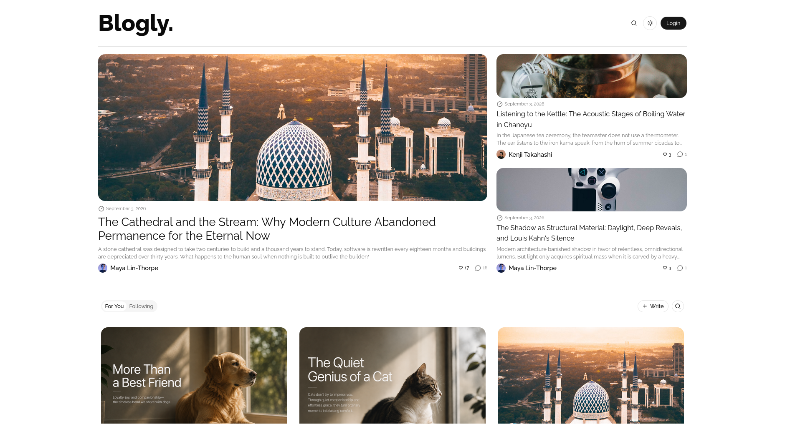
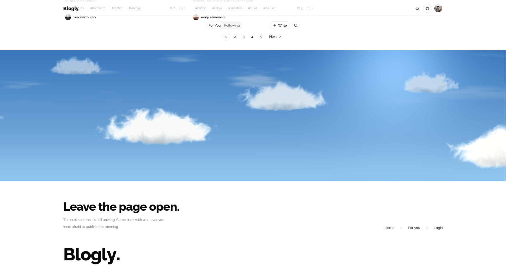
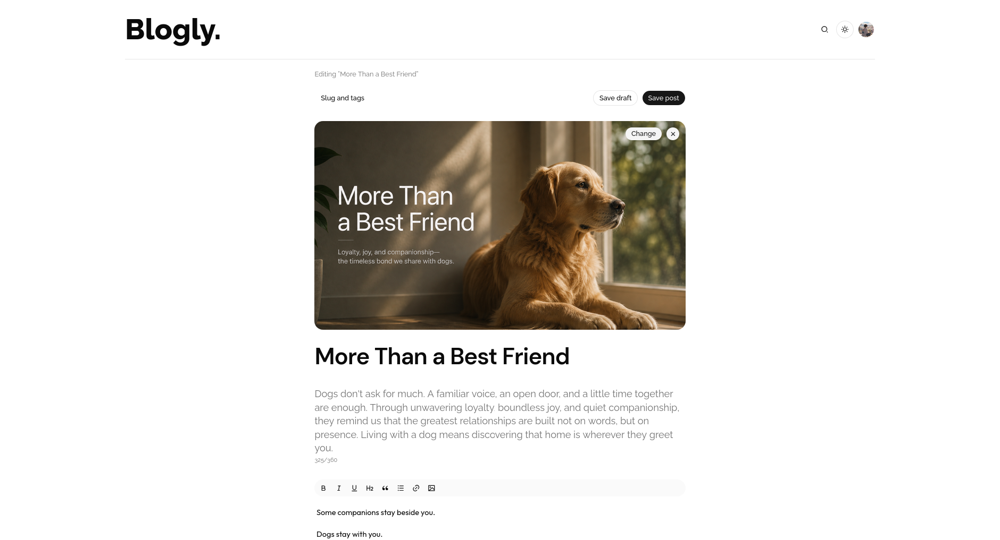
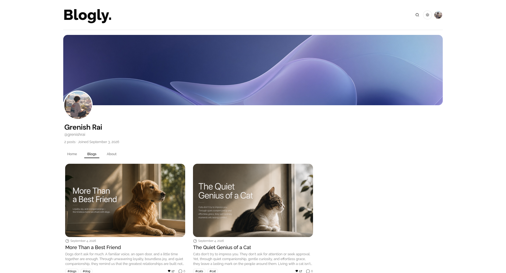
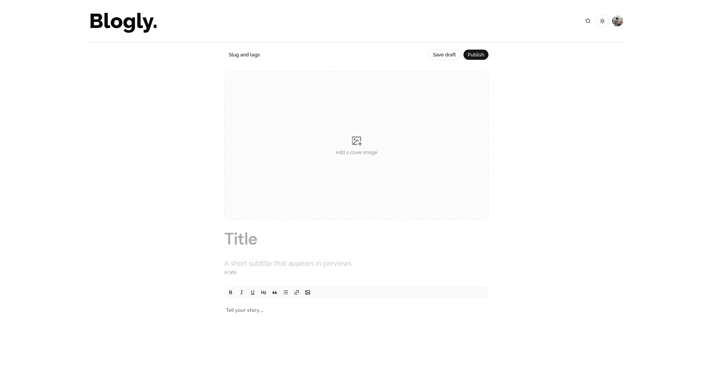
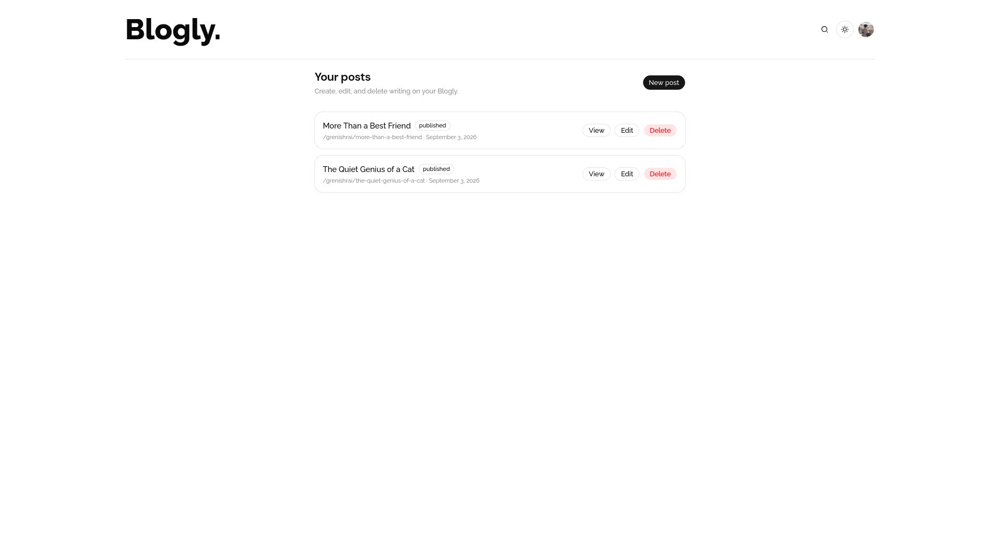
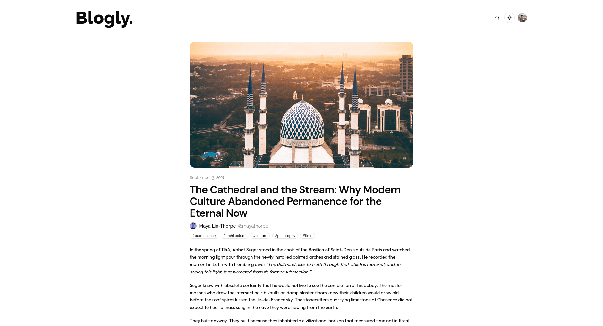
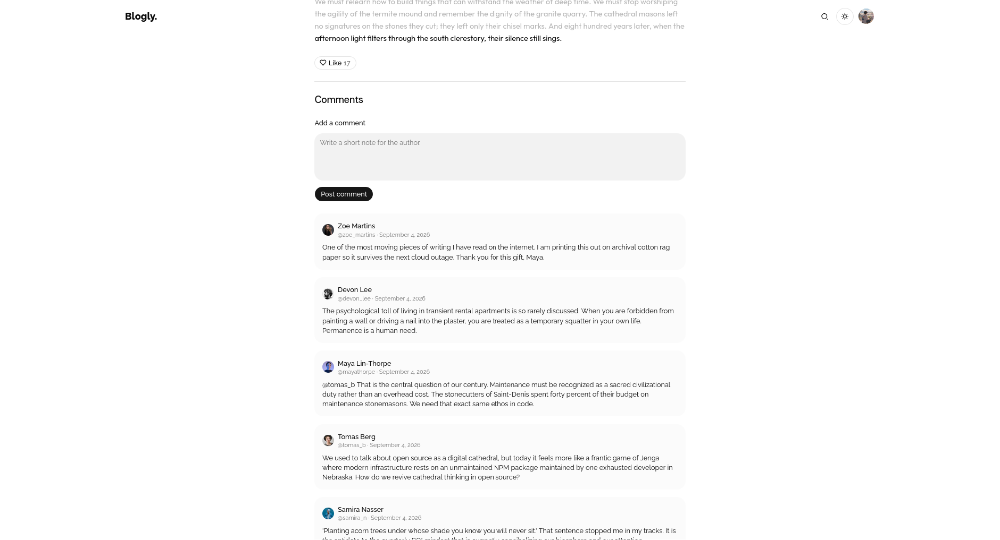

# Blogly



A multi-author blogging app. Anyone can read. Sign-in is required to write, comment, like, and follow.

## Stack

| Layer | Choice |
| --- | --- |
| Runtime | Node.js 20+, Next.js 16 (App Router, Cache Components) |
| UI | React 19, Tailwind CSS 4, shadcn/ui (Base UI), Remixicon |
| Auth | Better Auth (email/password) |
| Database | Neon Postgres, Drizzle ORM |
| Uploads | UploadThing |
| Editor | Tiptap 3 |
| Package manager | npm |

## Requirements

- Node.js 20+
- A Neon (or other Postgres) database
- An [UploadThing](https://uploadthing.com) token

## Environment

Copy `.env.example` to `.env` and fill in:

| Variable | Purpose |
| --- | --- |
| `DATABASE_URL` | Pooled Postgres URL (app) |
| `DATABASE_URL_UNPOOLED` | Direct Postgres URL (migrations) |
| `BETTER_AUTH_SECRET` | Auth signing secret |
| `BETTER_AUTH_URL` | Public origin, e.g. `http://localhost:3000` |
| `UPLOADTHING_TOKEN` | Image uploads |
| `NEON_BRANCH` | Optional Neon branch name |

## Setup

```bash
npm ci
npx drizzle-kit migrate
npm run db:seed
npm run dev
```

App: `http://localhost:3000`

Seed accounts use password `SeedPass1!`:

- `mira@blogly.dev` / `mira`
- `julian@blogly.dev` / `julian`
- `elena@blogly.dev` / `elena`

Re-running the seed is idempotent for those authors.

## Scripts

| Command | Action |
| --- | --- |
| `npm run dev` | Dev server |
| `npm run build` | Production build |
| `npm run start` | Serve the build |
| `npm run lint` | ESLint |
| `npm run db:generate` | Generate a Drizzle migration |
| `npm run db:migrate` | Apply migrations |
| `npm run db:seed` | Seed sample authors and posts |

## Routes

| Path | Access |
| --- | --- |
| `/` | Public feed (For You, Following) |
| `/search?q=` | Public search (posts/people, sort, tags, recency) |
| `/signin`, `/signup` | Auth |
| `/[username]` | Public author profile |
| `/[username]/[slug]` | Public post |
| `/admin` | Own posts (session) |
| `/admin/new`, `/admin/[postId]/edit` | Editor (session) |
| `/settings/account` | Profile, avatar, header image |
| `/settings/security` | Password |
| `/settings/manage` | Account management |
| `/api/auth/[...all]` | Better Auth |
| `/api/uploadthing` | Uploads |

Reserved usernames: `admin`, `signin`, `signup`, `settings`, `api`, `search`.

## Data

Postgres tables: `user`, `session`, `account`, `verification`, `blogs`, `comments`, `likes`, `follows`.

Posts: `draft` \| `published` \| `archived`. Slugs are unique per author. Public lists show published posts from non-disabled users, 8 per page.

Schema lives in `lib/db/schemas/`. Migrations live in `drizzle/`.

## Auth and uploads

Better Auth stores credentials in Postgres. Sessions are read through `lib/session.ts`. Sign-up requires name, unique email, unique username, and a password of at least 8 characters.

UploadThing routes (signed-in only):

- `coverImage`, `postImage`, `headerImage` — 8 MB
- `avatarImage` — 4 MB

URLs are stored on the user or post row.

## Caching

`cacheComponents` is on. Public post queries use `"use cache"` with tag `posts`. Mutations in `app/actions/` call `updateTag` and `revalidatePath` so new posts appear without a hard reload.

## Layout

```
app/                 routes, server actions, API
components/          UI (editor, cards, settings)
lib/db/              schema, queries, seed
lib/                 auth, session, cache, search
drizzle/             SQL migrations
```

## Screenshots









